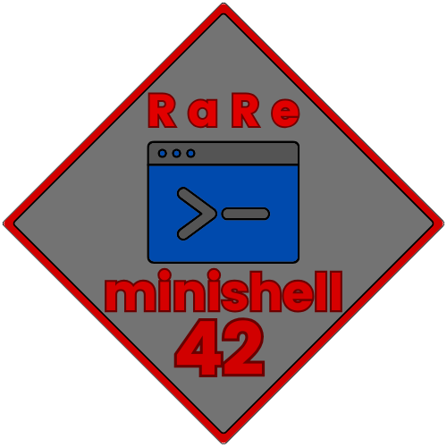

  
  <h2>42 RaRe Shell Project</h2>
    
    
    
    
    
   
<h4>
    <a href="https://github.com/emre-mr246/42_ring3_minishell/issues">❔ Ask a Question</a>
   · 
    <a href="https://github.com/emre-mr246/42_ring3_minishell/issues">🪲 Report Bug</a>
   · 
    <a href="https://github.com/emre-mr246/42_ring3_minishell/issues">💬 Request Feature</a>
</h4>

## Introduction 🚀

The 42 Minishell project is an exploration into creating a basic Unix shell, a fundamental component of operating systems that allows users to interact with the system through command-line interfaces. This project challenges us to delve deep into system-level programming techniques and understand core Unix functionalities.

A Unix shell interprets user commands and executes them. It manages processes, handles input and output redirection, supports command chaining through pipes (|), manages environment variables, and more. The goal of the Minishell project is to implement these functionalities using C programming language and various system calls provided by Unix-like operating systems.

## RaRe Shell Is a Group Project

In the 42 curriculum, there are various group projects that must be completed with a specified number of participants. This requirement helps us develop our collaboration skills in project settings, preparing us to adapt more effectively to future jobs.

Our project is named RaRe Shell, derived from the last two letters of the names of the project creators, MısRa and EmRe. Instead of writing our parts separately and then merging the code, we chose to write all the code together. We share equal ownership of the entire codebase.

## Image 📸

## Usage 🔍

1. In the project's main directory, compile the library using the `make` command.
   `$ make bonus` 

2. You can run the minishell with the following command:
   `$ ./minishellf` 
    
